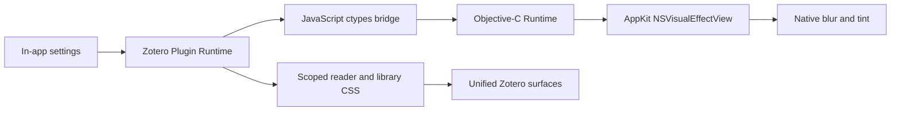

<div align="center">


# Zotero Glass

### 让 Zotero 真正融入 macOS
### Native glass materials for Zotero on macOS

<a href="README_EN.md">
  
</a>

<br><br>

[](https://github.com/Avi7ii/Zotero-glass/releases/latest)
[](https://github.com/Avi7ii/Zotero-glass/releases)
[](https://github.com/Avi7ii/Zotero-glass/actions/workflows/ci.yml)
[](LICENSE)

[](https://www.apple.com/macos/)
[](https://www.zotero.org/)
[](#重要说明)
[](https://github.com/Avi7ii/Zotero-glass/stargazers)


<br>


<br>

<a href="https://github.com/Avi7ii/Zotero-glass/releases/latest">
  
</a>

<br><br>

**[效果预览](#效果预览) · [核心能力](#核心能力) · [安装](#安装) · [参数](#参数说明) · [构建](#从源码构建) · [常见问题](#常见问题)**

</div>

---

## 重要说明

> **仅适用于 macOS，且当前只适配 Zotero 暗色主题。**
>
> 插件启用后会自动将 Zotero 切换到暗色模式。Zotero Glass 的材质、遮罩、文字层级和侧栏通透度均围绕暗色界面设计，因为深色玻璃能呈现更统一、更克制也更高级的视觉效果。当前版本不支持 Windows、Linux 或 Zotero 亮色主题。

---

## 这是什么

Zotero Glass 是一个面向 macOS 的 Zotero 原生材质插件。它通过 Zotero 插件运行时直接调用 AppKit，在窗口中插入真正的 `NSVisualEffectView`，而不是仅用透明色模拟玻璃。

它不需要 Helper 应用、LaunchAgent、`userChrome.css` 或额外动态库。安装一个 XPI，即可获得主文库、PDF 阅读器侧栏、标注弹窗与设置页面的一致玻璃材质。

<div align="center">

| CSS 仿玻璃 | **Zotero Glass** |
| :---: | :---: |
| 只改变颜色和透明度 | **调用原生 AppKit 材质** |
| 背景清晰穿透或纯色叠层 | **真实动态模糊与背景采样** |
| 不同区域容易割裂 | **主窗口与阅读器统一调度** |
| 参数通常写死 | **应用内即时调节** |

</div>

---

## 效果预览

<p align="center">
  
</p>

<p align="center"><sub>暗色 PDF 阅读器、双侧玻璃栏与半透明标注弹窗</sub></p>

<p align="center">
  
</p>

> 截图中的期刊分区、影响因子和阅读状态来自 Ethereal Style/EasyScholar。Zotero Glass 负责玻璃材质与这些元素的视觉融合，不负责生成学术评价数据。

---

## 核心能力

<div align="center">

| 能力 | 实现 |
| :--- | :--- |
| 原生玻璃 | 直接调用 `NSVisualEffectView` 与系统 AppKit 材质 |
| 主文库 | 标题栏、工具栏、列表、左右侧栏保持同一视觉层级 |
| PDF 阅读器 | 缩略图侧栏、右侧信息栏与阅读器工具栏统一玻璃效果 |
| 标注弹窗 | 半透明深色材质、背景模糊，同时保持文本可读性 |
| 独立侧栏 | 可单独设置侧栏透明度、模糊、颜色与材质 |
| 即时设置 | 在 Zotero 内调整并立即应用，无需编辑 CSS |
| 状态标签 | 与 `/done`、`/reading`、`/unread` 状态列进行可选视觉整合 |
| 干净撤场 | 禁用插件时移除注入样式、定时器和原生视图，并恢复主题设置 |

</div>

---

## 工作方式



原生视图负责窗口级背景采样和模糊，插件内的限定样式负责让 Zotero 自身面板正确透出材质。两者缺一不可，但都已经封装在 XPI 中。

---

## 系统要求

| 项目 | 要求 |
| :--- | :--- |
| 操作系统 | macOS |
| Zotero | 9.x |
| 主题 | 仅暗色主题；插件启用后自动切换 |
| 处理器 | Apple Silicon 或 Intel Mac |
| 额外进程 | 无 |
| 外部动态库 | 无 |

Windows 和 Linux 暂不支持。核心玻璃依赖 macOS AppKit；其他平台需要分别实现 DWM/Mica 或对应桌面环境的原生后端。亮色主题也暂未适配。

---

## 安装

### 方式一：下载 Release

1. 从 [Releases](https://github.com/Avi7ii/Zotero-glass/releases/latest) 下载最新的 `Zotero-Glass-*.xpi`。
2. 打开 Zotero，进入 **工具 > 插件**。
3. 点击齿轮菜单，选择 **从文件安装插件**。
4. 选择下载的 XPI，并按提示重启 Zotero。

安装后可通过首页工具栏的 Zotero Glass 按钮，或 **工具 > Zotero Glass 偏好设置** 打开设置。

### 方式二：从源码构建

```bash
git clone https://github.com/Avi7ii/Zotero-glass.git
cd Zotero-glass
./build.sh
```

脚本会先执行全部测试，再将可安装 XPI 输出到 `dist/`。

---

## 参数说明

| 参数 | 作用 |
| :--- | :--- |
| 背景透明度 | 控制透出桌面和后方窗口的程度 |
| 模糊强度 | 控制玻璃的磨砂感与背景辨识度 |
| 背景颜色 | 为系统玻璃增加统一深色或彩色遮罩 |
| 玻璃材质 | 切换 HUD、窗口背景、侧边栏、菜单等 AppKit 材质 |
| 侧栏独立调节 | 让 PDF 与文库侧栏使用独立参数，默认可跟随整体设置 |

配置保存在：

```text
~/Library/Application Support/ZoteroGlass/config.json
```

---

## 与其他插件协作

- **Ethereal Style / EasyScholar**：提供期刊分区、影响因子和自定义状态列；Zotero Glass 只负责视觉整合。
- **普通 Zotero 标签**：`/done`、`/reading`、`/unread` 仍然是标准 Zotero 标签，不会转换成私有数据格式。
- **无 Style 用户**：原生玻璃、阅读器侧栏、弹窗和设置功能照常工作。

---

## 常见问题

<details>
<summary><b>为什么只支持 macOS？</b></summary>
<br>
当前原生桥接直接调用 AppKit 的 <code>NSVisualEffectView</code>。Windows 需要独立的 DWM Acrylic/Mica 后端，并不是改几行 CSS 就能获得相同效果。
</details>

<details>
<summary><b>为什么只支持暗色主题？</b></summary>
<br>
当前所有材质参数、深色遮罩、文字对比度和 PDF 侧栏层级都以暗色主题为设计基准。插件会在启用时自动切换到暗色模式，并在禁用时恢复此前的主题设置。亮色主题需要另一套独立的材质与可读性标定，当前版本不提供。
</details>

<details>
<summary><b>它会不会修改我的 Zotero 数据或列布局？</b></summary>
<br>
不会。发布版本不重写文献、标签、PDF、数据库或用户列布局。插件只管理自身设置、窗口材质和限定范围内的界面样式。
</details>

<details>
<summary><b>禁用插件后会留下什么？</b></summary>
<br>
原生视图、注入样式和运行中的定时器会被移除，启用插件前的 Zotero 主题设置会恢复。用户配置文件会保留，方便重新启用。
</details>

<details>
<summary><b>为什么期刊标签没有出现？</b></summary>
<br>
期刊分区和影响因子不是 Zotero Glass 生成的，需要 Ethereal Style/EasyScholar。Zotero Glass 不伪造或内置第三方学术评价数据。
</details>

---

## 开发与验证

```bash
python3 -m unittest discover -s tests -v
./build.sh
```

每次推送都会通过 GitHub Actions 在 macOS runner 上重新测试并构建 XPI。

---

<div align="center">

### Research should feel at home on the Mac.

Made for Zotero, backed by native AppKit.

[报告问题](https://github.com/Avi7ii/Zotero-glass/issues) · [查看版本](https://github.com/Avi7ii/Zotero-glass/releases) · [参与贡献](https://github.com/Avi7ii/Zotero-glass/pulls)

<br>


</div>
