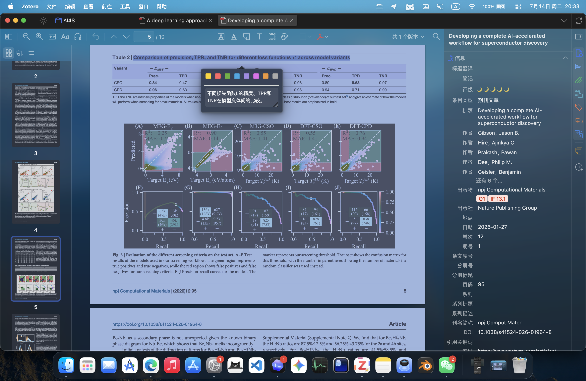
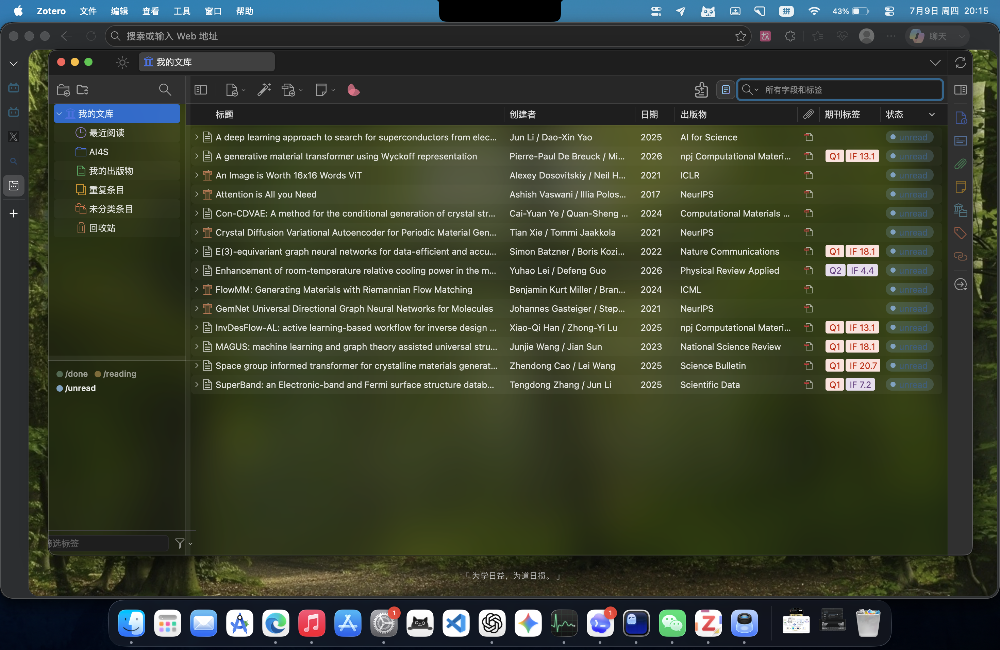
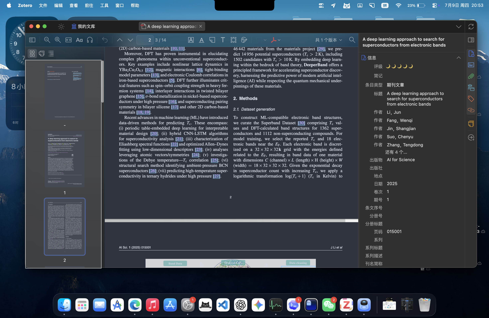
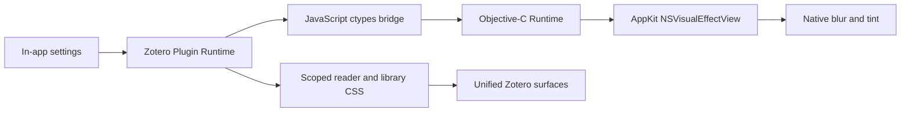

<div align="center">


# Zotero Glass

### Native glass materials for Zotero on macOS
### Let Zotero feel at home on the Mac

<a href="README.md">
  
</a>

<br><br>

[](https://github.com/Avi7ii/Zotero-glass/releases/latest)
[](https://github.com/Avi7ii/Zotero-glass/releases)
[](https://github.com/Avi7ii/Zotero-glass/actions/workflows/ci.yml)
[](LICENSE)

[](https://www.apple.com/macos/)
[](https://www.zotero.org/)
[](#important)
[](https://github.com/Avi7ii/Zotero-glass/stargazers)


<br>


<br>

<a href="https://github.com/Avi7ii/Zotero-glass/releases/latest">
  
</a>

</div>

---

## Important

> **Zotero Glass is currently macOS-only and dark-theme-only.**
>
> Enabling the plugin automatically switches Zotero to dark mode. Its materials, tint masks, typography contrast, and sidebar transparency are deliberately tuned for a dark interface, where native glass looks more coherent, restrained, and premium. Windows, Linux, and Zotero's light theme are not supported by the current release.

---

## What is Zotero Glass?

Zotero Glass is a native-material plugin for Zotero on macOS. It calls AppKit directly from the Zotero plugin runtime and inserts a real `NSVisualEffectView` into Zotero windows instead of imitating glass with a translucent CSS color.

The complete runtime ships inside one XPI. No helper application, LaunchAgent, `userChrome.css`, or separately compiled dynamic library is required.

| CSS imitation | **Zotero Glass** |
| :--- | :--- |
| Changes opacity and color | **Uses native AppKit materials** |
| Clear transparency or a flat overlay | **Dynamic background sampling and blur** |
| Surfaces often look disconnected | **Coordinates library and reader surfaces** |
| Parameters are commonly hard-coded | **Live controls inside Zotero** |

---

## Preview

<p align="center">
  
</p>

<p align="center"><sub>Dark PDF reader, dual glass sidebars, and a translucent annotation popup</sub></p>

<p align="center">
  
</p>

<p align="center">
  
</p>

> Journal rankings, impact factors, and reading-status columns in the screenshots are supplied by Ethereal Style/EasyScholar. Zotero Glass integrates their appearance but does not generate academic ranking data.

---

## Features

| Feature | Implementation |
| :--- | :--- |
| Native glass | Direct `NSVisualEffectView` and AppKit material bridge |
| Zotero library | A consistent hierarchy across title bar, toolbar, list, and sidebars |
| PDF reader | Unified thumbnail sidebar, metadata pane, and reader toolbar |
| Annotation popups | Readable dark translucent surfaces with background blur |
| Independent sidebars | Separate transparency, blur, tint, and material controls |
| Live settings | Apply changes inside Zotero without editing CSS |
| Status integration | Optional styling for `/done`, `/reading`, and `/unread` Style columns |
| Clean shutdown | Removes injected styles, timers, and native views and restores theme state |

---

## Architecture



The native view performs window-level background sampling and blur. Scoped plugin CSS lets Zotero's own panels reveal that material correctly. Both layers are bundled in the XPI.

---

## Requirements

| Item | Requirement |
| :--- | :--- |
| Operating system | macOS |
| Zotero | 9.x |
| Theme | Dark only; enabled automatically while the plugin is active |
| Processor | Apple Silicon or Intel Mac |
| Helper process | None |
| External dynamic library | None |

Windows and Linux are not currently supported. Matching those platforms requires separate native DWM/Mica or desktop-environment backends. Zotero's light theme is also not currently supported.

---

## Installation

1. Download the latest `Zotero-Glass-*.xpi` from [Releases](https://github.com/Avi7ii/Zotero-glass/releases/latest).
2. Open Zotero and go to **Tools > Plugins**.
3. Open the gear menu and choose **Install Plugin From File**.
4. Select the XPI and restart Zotero if requested.

Open settings from the Zotero Glass button in the main toolbar or from **Tools > Zotero Glass Preferences**.

---

## Settings

| Control | Purpose |
| :--- | :--- |
| Background transparency | Controls how much of the desktop and rear windows remains visible |
| Blur strength | Controls diffusion and background legibility |
| Background color | Adds a consistent dark or colored tint over the system material |
| Glass material | Selects HUD, under-window, sidebar, menu, or regular-window AppKit materials |
| Independent sidebar controls | Gives the library and reader sidebars a separate appearance profile |

Settings are stored at:

```text
~/Library/Application Support/ZoteroGlass/config.json
```

---

## Build from source

```bash
git clone https://github.com/Avi7ii/Zotero-glass.git
cd Zotero-glass
./build.sh
```

The script runs the complete test suite before writing an installable XPI to `dist/`.

---

## FAQ

<details>
<summary><b>Does the plugin modify my Zotero data or column layout?</b></summary>
<br>
No. The public build does not rewrite library items, tags, PDFs, databases, or user column preferences. It manages only its own settings, native window material, and scoped UI styles.
</details>

<details>
<summary><b>Why is only the dark theme supported?</b></summary>
<br>
Every material, tint mask, text contrast level, and PDF sidebar layer is calibrated around Zotero's dark interface. The plugin switches to dark mode while active and restores the prior theme state when disabled. A light theme requires a separate material and readability calibration that is not included in the current release.
</details>

<details>
<summary><b>What remains after disabling the plugin?</b></summary>
<br>
Injected styles, timers, and native views are removed, and the prior Zotero theme setting is restored. The user configuration file remains so settings survive a later reinstall.
</details>

<details>
<summary><b>Why are journal badges missing?</b></summary>
<br>
Journal rankings and impact factors require Ethereal Style/EasyScholar. Zotero Glass deliberately does not bundle or fabricate third-party academic evaluation data.
</details>

---

<div align="center">

### Research should feel at home on the Mac.

Made for Zotero, backed by native AppKit.

[Issues](https://github.com/Avi7ii/Zotero-glass/issues) · [Releases](https://github.com/Avi7ii/Zotero-glass/releases) · [Pull requests](https://github.com/Avi7ii/Zotero-glass/pulls)

<br>


</div>
